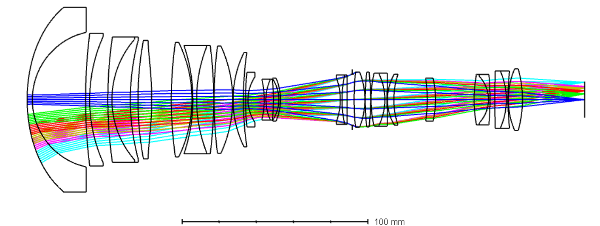
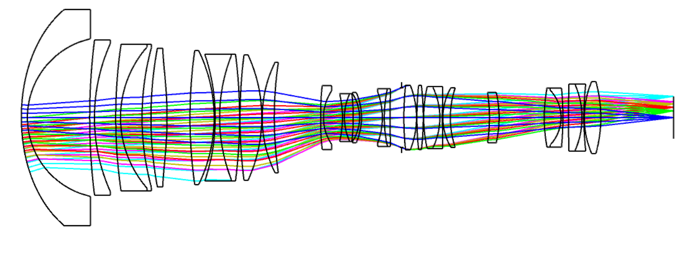
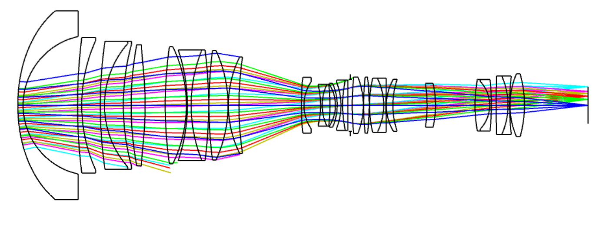

# Visible Day Camera Zoom Lens

This project builds the visible zoom lens for the day camera of the Electro Optical Tracking System.

The lens uses a Sony IMX530 class sensor with 2.74 µm pixel pitch.

The design is a continuous zoom lens. The three Zemax configurations below are important zoom positions of the same optical system.

## Configuration 1

Wide search position

Approximate focal length: **15 mm**

## Configuration 2

Intermediate tracking position

Approximate focal length: **35 mm**

## Configuration 3

Tele tracking position

Approximate focal length: **75 mm**

## Multi Configuration Editor

The same optical elements are used in all three configurations.

Only three internal air gaps change during zoom.

| Configuration | Surface 18 air gap | Surface 25 air gap | Surface 28 air gap |
| --- | ---: | ---: | ---: |
| Wide | 1.2000 mm | 32.2147 mm | 2.7353 mm |
| Mid | 21.3400 mm | 9.5900 mm | 5.2300 mm |
| Tele | 32.8900 mm | 1.9800 mm | 1.2800 mm |

The glass materials, lens radii, center thicknesses and aspheric surfaces remain common to all three configurations.

## Visible wavelengths

| Line | Wavelength |
| --- | ---: |
| F | 0.486133 µm |
| d | 0.587562 µm |
| C | 0.656273 µm |

The d line is the primary wavelength.

## Script

`build_day_zoom_lens_3config.py`

The script creates the complete Zemax lens from a new Sequential Mode file and sets all three configurations in the Multi Configuration Editor.
