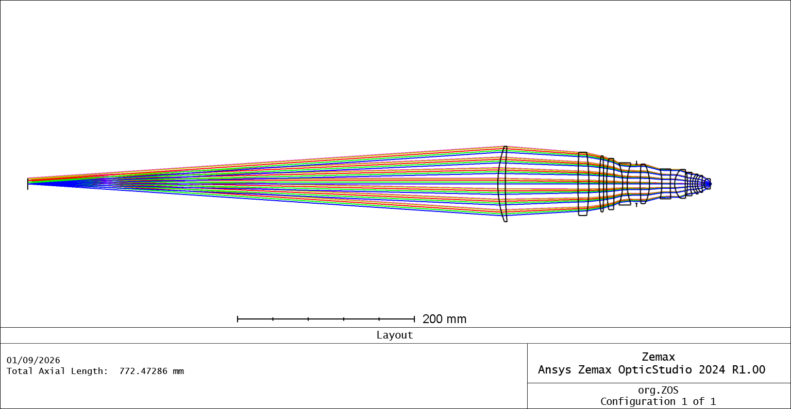
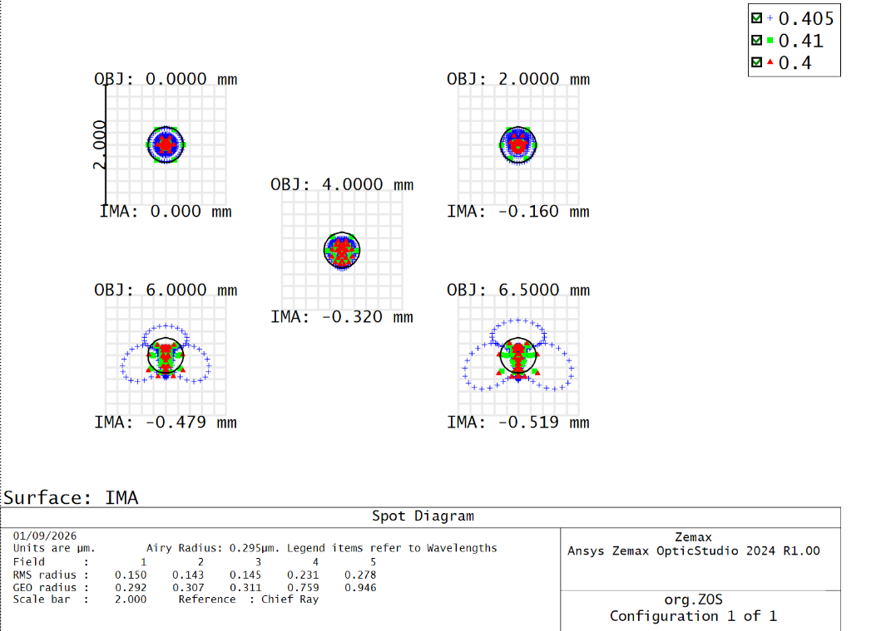
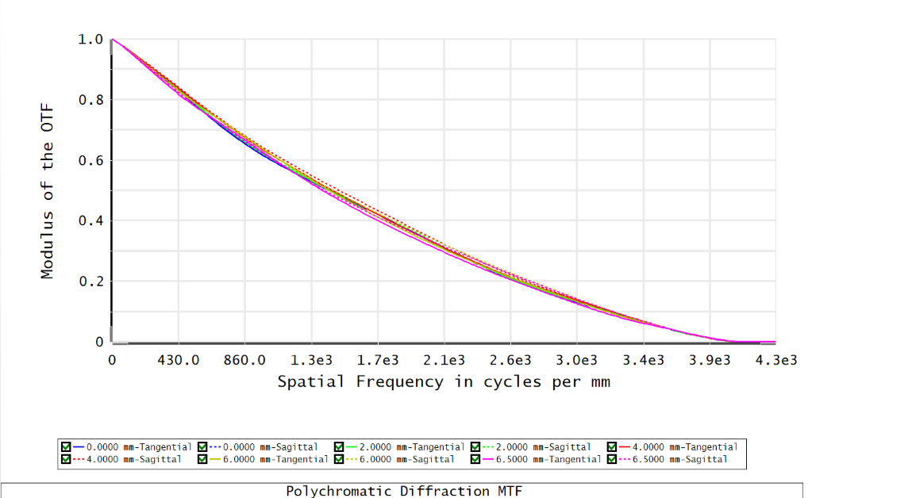

# DMD Based Maskless Lithography

This project focuses on the optical design and optimization of a high resolution projection system for DMD based maskless lithography using Ansys Zemax OpticStudio.

The DMD acts as a programmable mask and the projection optics demagnify the DMD pattern onto the image plane. The current design is developed around a 405 nm source with approximately 0.08× demagnification and high image space numerical aperture, with the goal of reaching sub micrometer and approximately 320 nm patterning resolution.

The optical system is optimized for diffraction limited focusing, low aberration, telecentric projection, and good performance across the required DMD field.

## Optical Layout

## Spot Diagram

The spot diagram is used to evaluate focusing performance across the DMD field and to check the wavelength dependent aberrations of the projection system.

## Diffraction MTF

The diffraction MTF is used to evaluate the spatial frequency response of the optimized projection optics and to verify that the system remains close to diffraction limited performance.

## Design Goal

The main objective is to develop a compact high resolution DMD projection system suitable for maskless lithography and investigate the practical resolution limit of the optical design.
